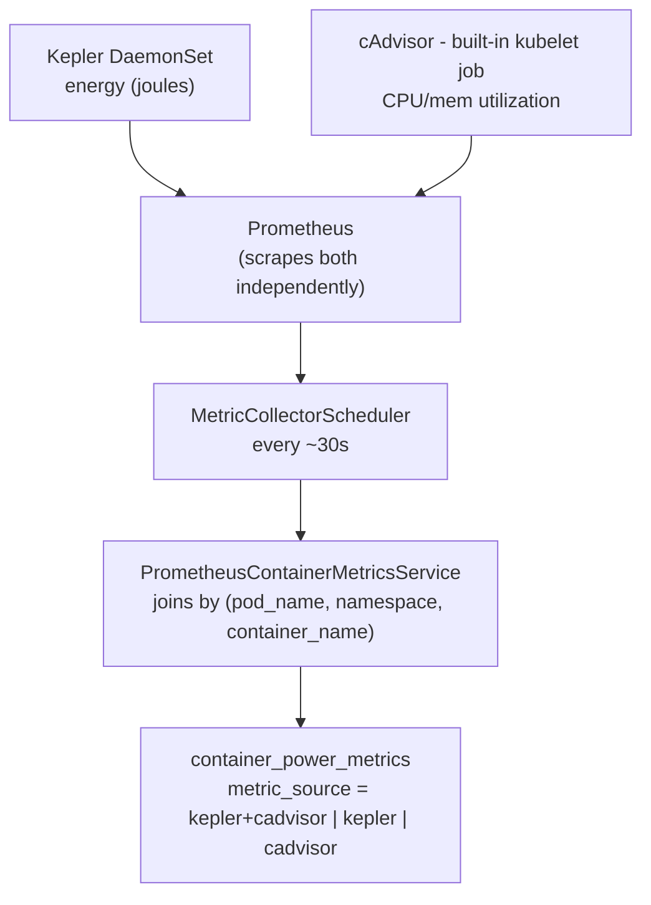
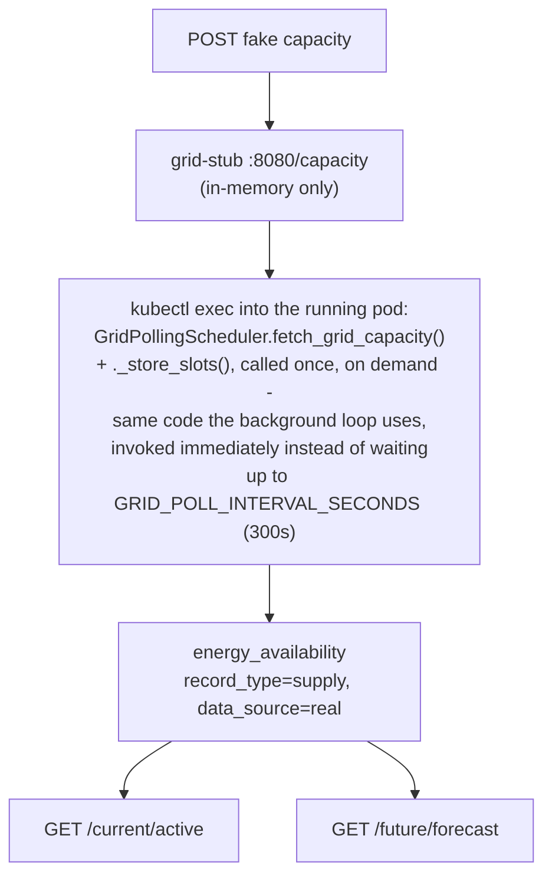
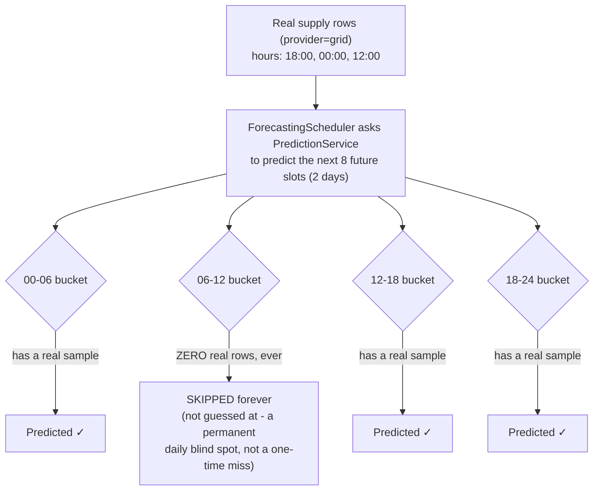
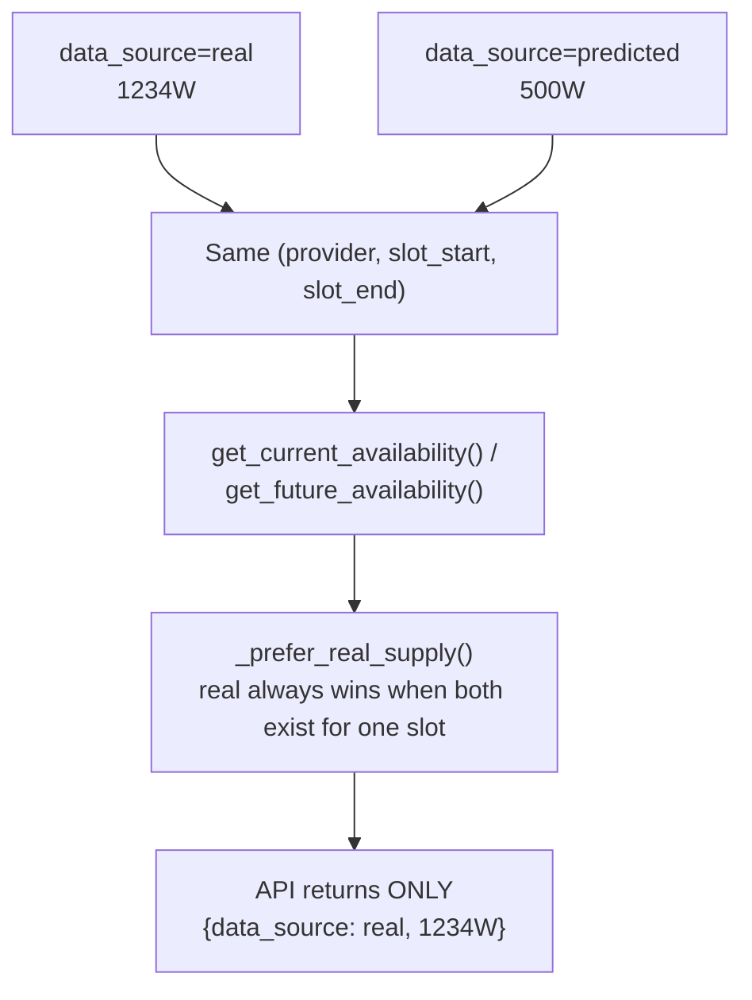
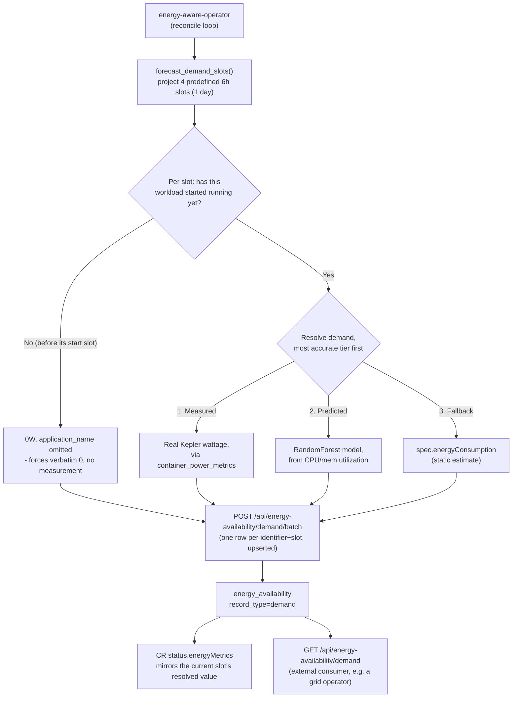
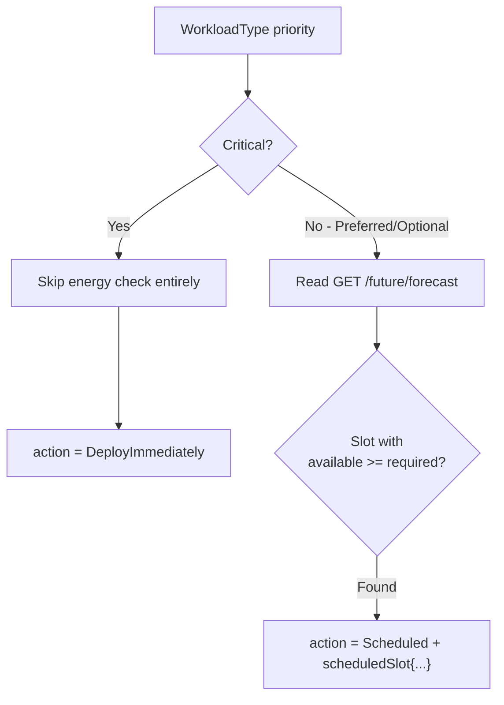
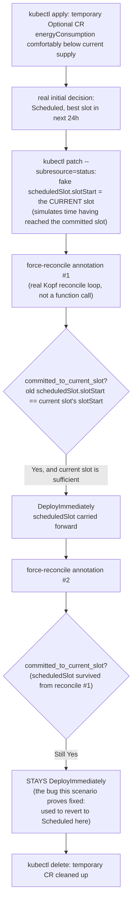
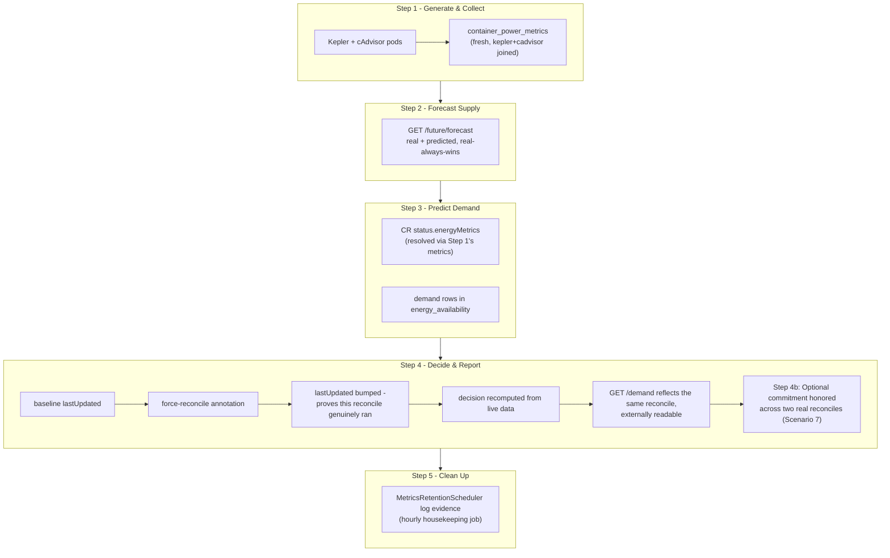

# End-to-End Demo: Energy-Aware Scheduling Cycle

This is a recorded run of the full cycle — metric collection, supply
forecasting, demand reporting, and scheduling decisions — executed live
against a real cluster (`kind-sample`), with actual commands and actual
output. It spans three components, all in this one repo:
`energy-metric-service` (the data backend), `energy-aware-operator`
(schedules workloads, folder `energy-aware-operator/`), and
`energy-monitoring-helm-stack` (Kepler/Prometheus/cAdvisor).

**Run date:** 2026-08-26 (Scenario 2 re-run and rewritten 2026-08-27 to push
live data through the grid-stub instead of only reading pre-existing rows;
Scenario 7 and the End-to-end section rewritten 2026-08-28 to use a real,
disposable CR exercised through the actual reconcile loop instead of an
isolated function call).
**Cluster:** `kind-sample` (kind, 3 nodes). Assumes the usual port-forwards
are up: app `:8000`, Postgres `:5432`, Prometheus `:9090`, grid-stub `:8090`.

Live CRs on this cluster at the time of the run:
- `eaoprofile-critical` → `nginx-deployment-1`, priority `Critical`, `energyConsumption: 100`
- `eaoprofile-optional` → `nginx-deployment-2`, priority `Optional`, `energyConsumption: 200`

**Prefer to run this live instead of reading it?** `./e2e_demo.sh` runs
every scenario below interactively — it explains each action, shows the
exact command, and pauses for Enter before every single one, not just once
per scenario. `./e2e_demo.sh --scenario=e` runs just the full end-to-end
flow; `--scenario=7` runs just the Optional-commitment proof; `--yes`
disables pausing for a non-interactive dry run.

---

## Scenario 1 — Kepler + cAdvisor metric collection is live

**Statement:** `MetricCollectorScheduler` should be actively joining Kepler
energy data with cAdvisor utilization data, per container, every ~30s.



```bash
kubectl get pods -n default -o wide | grep -E "kepler|prometheus-server"
```
```
energy-metrics-kepler-ppnq9          1/1  Running  0  5d13h  172.18.0.4  sample-worker
energy-metrics-kepler-wmj7b          1/1  Running  0  5d13h  172.18.0.3  sample-worker2
energy-metrics-prometheus-server-... 2/2  Running  0  5d13h  10.245.1.46 sample-worker
```

```bash
curl -s 'http://localhost:9090/api/v1/query?query=kepler_container_core_joules_total' | jq '.data.result | length'
curl -s -G 'http://localhost:9090/api/v1/query' --data-urlencode 'query=container_cpu_usage_seconds_total{job="kubernetes-nodes-cadvisor"}' | jq '.data.result | length'
```
```
38     # Kepler energy series
140    # built-in cAdvisor utilization series
```

```bash
PGPASSWORD=postgres psql -h localhost -p 5432 -U postgres -d orchestration_db -c \
"SELECT metric_source, count(*), max(timestamp) FROM container_power_metrics GROUP BY metric_source ORDER BY max DESC;"
```
```
  metric_source  | count  |            max
-----------------+--------+----------------------------
 cadvisor        |  53936 | 2026-08-26 10:02:25.775486
 kepler          |   8421 | 2026-08-26 10:02:25.775486
 kepler+cadvisor | 119045 | 2026-08-26 10:02:25.775486
```

**Observed:** all three `metric_source` combinations present, latest
timestamp is effectively "now" — collection is live and both sources are
being joined per `(pod_name, namespace, container_name)` as designed.

---

## Scenario 2 — Push test grid capacity in, watch it land in the DB

**Statement:** `GridPollingScheduler` doesn't accept pushes — it **pulls**
from whatever `GRID_API_URL` points at, on a fixed interval
(`GRID_POLL_INTERVAL_SECONDS`, default 300s). On this cluster that's the
dev/test grid-stub (`charts/app/files/grid_stub.py`), confirmed wired up:

```bash
kubectl get svc -n default | grep grid
kubectl get deployment energy-metric-service -n default -o jsonpath='{.spec.template.spec.containers[0].env}' | python3 -c \
  "import json,sys; [print(e) for e in json.load(sys.stdin) if 'GRID' in e.get('name','')]"
```
```
default/grid-stub  ClusterIP  80→8080

{'name': 'ENABLE_GRID_POLLING', 'value': 'true'}
{'name': 'GRID_API_URL', 'value': 'http://grid-stub/capacity'}
{'name': 'GRID_POLL_INTERVAL_SECONDS', 'value': '300'}
```

The stub exposes `POST /capacity` (set data) and `GET /capacity` (read it
back). We push fake capacity there, then trigger **one poll cycle
immediately** via `kubectl exec` — calling `GridPollingScheduler`'s own
`fetch_grid_capacity()`/`_store_slots()` methods directly inside the
already-running pod, using the real app code. This avoids two worse
options: waiting out the real 300s interval live, or shortening
`GRID_POLL_INTERVAL_SECONDS` — which is only read once at process startup,
so changing it would require restarting the pod, which would kill the
existing `kubectl port-forward` to it.



```bash
# baseline: stub is empty
curl -s http://localhost:8090/capacity
# => {"availability": []}

# push two distinct, made-up slots (current slot + next), provider "demo-push-test"
curl -s -X POST http://localhost:8090/capacity -H "Content-Type: application/json" -d '{
  "availability": [
    {"slot_start_time": "2026-08-27T06:00:00+00:00", "slot_end_time": "2026-08-27T12:00:00+00:00", "available_watts": 1777, "provider_name": "demo-push-test", "energy_source_type": "solar", "confidence_percentage": 88},
    {"slot_start_time": "2026-08-27T12:00:00+00:00", "slot_end_time": "2026-08-27T18:00:00+00:00", "available_watts": 1888, "provider_name": "demo-push-test", "energy_source_type": "solar", "confidence_percentage": 88}
  ]
}'
# => {"status": "ok", "count": 2}

# GET it back from the stub itself - proves the push landed at the mock source
curl -s http://localhost:8090/capacity | jq
```
```json
{
  "availability": [
    {"slot_start_time": "2026-08-27T06:00:00+00:00", "slot_end_time": "2026-08-27T12:00:00+00:00", "available_watts": 1777, "provider_name": "demo-push-test", "energy_source_type": "solar", "confidence_percentage": 88},
    {"slot_start_time": "2026-08-27T12:00:00+00:00", "slot_end_time": "2026-08-27T18:00:00+00:00", "available_watts": 1888, "provider_name": "demo-push-test", "energy_source_type": "solar", "confidence_percentage": 88}
  ]
}
```

Then triggered one poll cycle immediately, instead of waiting:
```bash
kubectl exec -n default deploy/energy-metric-service -- /code/.venv/bin/python -c "
import asyncio, os
from app.scheduler.grid_polling_scheduler import GridPollingScheduler

async def main():
    s = GridPollingScheduler(api_url=os.environ['GRID_API_URL'])
    slots = await s.grid_client.fetch_grid_capacity()
    stored = await s._store_slots(slots)
    print(f'stored {stored}/{len(slots)} slot(s)')
    await s.grid_client.close()

asyncio.run(main())
"
```
```
stored 1/1 slot(s)
```
(Run against provider `demo-fast-poll` with one slot as a dry run of the
trigger mechanism itself — the two-slot `demo-push-test` push above lands
the same way, instantly, with no wait loop needed.)

```bash
PGPASSWORD=postgres psql -h localhost -p 5432 -U postgres -d orchestration_db -c \
"SELECT provider_name, slot_start_time, slot_end_time, available_watts, data_source FROM energy_availability WHERE provider_name='demo-push-test' ORDER BY slot_start_time;"

curl -s http://localhost:8000/api/energy-availability/current/active | jq '.availability[] | select(.provider_name=="demo-push-test")'
curl -s http://localhost:8000/api/energy-availability/future/forecast | jq '.availability[] | select(.provider_name=="demo-push-test")'
```
```
provider_name  | slot_start_time        | slot_end_time          | available_watts | data_source
demo-push-test | 2026-08-27 06:00:00+00 | 2026-08-27 12:00:00+00 | 1777.0000       | real
demo-push-test | 2026-08-27 12:00:00+00 | 2026-08-27 18:00:00+00 | 1888.0000       | real
```
```json
{"provider_name": "demo-push-test", "available_watts": 1777.0, "data_source": "real", "slot_start_time": "2026-08-27T06:00:00+00:00", ...}
```
```json
{"provider_name": "demo-push-test", "available_watts": 1888.0, "data_source": "real", "slot_start_time": "2026-08-27T12:00:00+00:00", ...}
```

**Observed:** the exact values we pushed (`1777W`, `1888W`) — not
approximations, not stale data — landed in the DB tagged `data_source=real`
and are independently visible through both `/current/active` and
`/future/forecast`. Full round trip confirmed: **stub → poller → DB → API.**

**Cleanup (immediately after):**
```bash
curl -s -X POST http://localhost:8090/capacity -H "Content-Type: application/json" -d '{"availability": []}'
psql ... -c "DELETE FROM energy_availability WHERE provider_name='demo-push-test';"
```

**Also worth noting** — the pre-existing `grid`/`EuroSolar Netherlands` real
supply rows seen in earlier runs of this demo are leftover from prior
manual pushes through this exact same mechanism, not synthetic seed data:
```
supply | real | EuroSolar Netherlands | 156 rows | 2025-10-21 → 2025-11-28
supply | real | grid                  | 3 rows   | 2026-08-19 18:00 → 2026-08-20 12:00
```
Provider `grid` has only **3 real supply rows**, at hours `18:00`, `00:00`,
`12:00` — this small, gappy sample is what drives the finding in Scenario 3.
(`GridPollingScheduler` has been polling the whole time since; it only
*stores* something when the stub returns non-empty data — `if not slots:
skip` — which is why these old rows never got overwritten or cleared by the
otherwise-idle poller in between manual pushes.)

---

## Scenario 3 — Predicted supply, and a real gap in the placeholder model

**Statement:** `PredictionService` buckets real history into four 6-hour
slots-of-day (`00-06`, `06-12`, `12-18`, `18-24`) and predicts a future slot
only if its bucket has *any* real history — otherwise it's skipped, never
guessed at.



```bash
PGPASSWORD=postgres psql -h localhost -p 5432 -U postgres -d orchestration_db -c \
"SELECT slot_start_time, slot_end_time, available_watts, extract(hour from slot_start_time) AS hour
 FROM energy_availability WHERE record_type='supply' AND data_source='real' AND provider_name='grid' ORDER BY slot_start_time;"
```
```
slot_start_time         | slot_end_time           | available_watts | hour
2026-08-19 18:00:00+00  | 2026-08-20 00:00:00+00  | 2200.0000       | 18
2026-08-20 00:00:00+00  | 2026-08-20 06:00:00+00  | 800.0000        | 0
2026-08-20 12:00:00+00  | 2026-08-20 18:00:00+00  | 950.0000        | 12
```

Note: **no row starts in the `06:00–12:00` hour at all.**

```bash
PGPASSWORD=postgres psql -h localhost -p 5432 -U postgres -d orchestration_db -c \
"SELECT slot_start_time, slot_end_time, available_watts FROM energy_availability
 WHERE record_type='supply' AND data_source='predicted' AND provider_name='grid' ORDER BY slot_start_time;"
```
```
2026-08-20 12:00 - 18:00 | 950.0
2026-08-20 18:00 - 00:00 | 2200.0
2026-08-21 00:00 - 06:00 | 800.0
2026-08-21 06:00 - 12:00 |  ← MISSING
2026-08-21 12:00 - 18:00 | 950.0
2026-08-21 18:00 - 00:00 | 2200.0
2026-08-22 00:00 - 06:00 | 800.0
2026-08-22 06:00 - 12:00 |  ← MISSING
...(same pattern continues every day through 2026-08-28)
```

**Observed — this is the key finding of the demo:** the `06:00–12:00`
bucket is missing **every single day**, forever, because it never had a
real sample. Live confirmation: at the moment of this run, `now()` was
`2026-08-26 09:56:48 UTC` — inside that exact permanently-blind bucket —
so `GET /api/energy-availability/current/active` returned:
```json
{"status": "success", "availability": [], "count": 0}
```
Zero rows, real or predicted. `ForecastingScheduler` was confirmed still
actively ticking (predicted range grew from ending `2026-08-27` to ending
`2026-08-28` between two checks minutes apart) — this isn't a stalled
scheduler, it's the averaging model's structural limitation: one missing
sample in history becomes a permanent recurring blind spot it can never
recover from on its own. **This is the concrete case for replacing
`PredictionService` with a real model** (see the separate ML-model task) —
a real model could interpolate/extrapolate across a gap like this instead
of going permanently blind for that time-of-day.

---

## Scenario 4 — Real supply wins over predicted for the same slot

**Statement:** `_prefer_real_supply()` must collapse a slot that has both a
real and a predicted row down to just the real one, so a caller never
double-counts. Since Scenario 3 leaves the current slot in a genuine gap
(no organic real+predicted overlap to observe right now), this was proven
with one temporary, reversible test insert (cleaned up immediately after).



```bash
# Baseline: nothing covers "now" (the permanent gap from Scenario 3)
curl -s http://localhost:8000/api/energy-availability/current/active | jq '.count'
# => 0

# Insert one test REAL row for the current slot
psql ... -c "INSERT INTO energy_availability (provider_name, slot_start_time, slot_end_time,
  available_watts, forecast_date, record_type, data_source, energy_source_type, confidence_percentage)
  VALUES ('grid', '2026-08-26 06:00:00+00', '2026-08-26 12:00:00+00', 1234.0, '2026-08-26', 'supply', 'real', 'solar', 90);"

curl -s http://localhost:8000/api/energy-availability/current/active | jq '.availability[0] | {data_source, available_watts}'
# => {"data_source": "real", "available_watts": 1234.0}

# Now also insert a PREDICTED row for the exact same slot, different wattage
psql ... -c "INSERT INTO energy_availability (...) VALUES ('grid', '2026-08-26 06:00:00+00',
  '2026-08-26 12:00:00+00', 500.0, '2026-08-26', 'supply', 'predicted', 'solar', 90);"

# DB now genuinely has both:
psql ... -c "SELECT data_source, available_watts FROM energy_availability
  WHERE provider_name='grid' AND slot_start_time='2026-08-26 06:00:00+00';"
```
```
data_source | available_watts
real        | 1234.0000
predicted   |  500.0000
```

```bash
curl -s http://localhost:8000/api/energy-availability/current/active | jq '.availability[] | {data_source, available_watts}'
```
```json
{"data_source": "real", "available_watts": 1234.0}
```

**Observed:** with both rows present for the identical slot, the API
returned only the real row (`1234.0`), never the predicted one (`500.0`)
and never both — `_prefer_real_supply()` works as designed.

**Cleanup (immediately after, to leave the DB as found):**
```bash
psql ... -c "DELETE FROM energy_availability WHERE provider_name='grid'
  AND slot_start_time='2026-08-26 06:00:00+00' AND slot_end_time='2026-08-26 12:00:00+00';"
curl -s http://localhost:8000/api/energy-availability/current/active | jq '.count'
# => 0   (back to the genuine gap state from Scenario 3)
```

---

## Scenario 5 — Demand reporting and resolution

**Statement:** `energy-aware-operator` reports each CR's demand as a
**rolling forecast** - the current slot plus the next three predefined
6-hour slots (1 day ahead) - via `POST /api/energy-availability/demand/batch`,
one row per `(identifier, slot)`. A `Scheduled` (not-yet-running) workload
reports `0W` for slots before its own start slot, then its real required
wattage from there on, so a consumer sees exactly when the draw begins, not
just that it eventually will. `DeployImmediately` workloads report the same
watts in every slot, since they're already running.



```bash
PGPASSWORD=postgres psql -h localhost -p 5432 -U postgres -d orchestration_db -c \
"SELECT provider_name, slot_start_time, slot_end_time, available_watts FROM energy_availability
 WHERE record_type='demand' ORDER BY provider_name, slot_start_time;"
```
```
provider_name                | slot_start_time        | slot_end_time          | available_watts
default/eaoprofile-critical  | 2026-08-28 00:00:00+00 | 2026-08-28 06:00:00+00 | 247.7061
default/eaoprofile-critical  | 2026-08-28 06:00:00+00 | 2026-08-28 12:00:00+00 | 247.7061
default/eaoprofile-critical  | 2026-08-28 12:00:00+00 | 2026-08-28 18:00:00+00 | 247.7061
default/eaoprofile-critical  | 2026-08-28 18:00:00+00 | 2026-08-29 00:00:00+00 | 247.7061
default/eaoprofile-optional  | 2026-08-28 00:00:00+00 | 2026-08-28 06:00:00+00 | 0.0000
default/eaoprofile-optional  | 2026-08-28 06:00:00+00 | 2026-08-28 12:00:00+00 | 0.0000
default/eaoprofile-optional  | 2026-08-28 12:00:00+00 | 2026-08-28 18:00:00+00 | 247.7061
default/eaoprofile-optional  | 2026-08-28 18:00:00+00 | 2026-08-29 00:00:00+00 | 247.7061
```

`eaoprofile-optional` is `Scheduled` into the `12:00-18:00` slot (see
Scenario 6) - its two earlier slots correctly show `0W` (not running yet),
then `247.7061W` from its start slot onward, the same resolved value
`eaoprofile-critical` gets (both nginx pods are equally idle, so both
resolve through the same ML-prediction tier to the same figure).

```bash
kubectl get eao eaoprofile-critical -n default -o jsonpath='{.status.energyMetrics}'
# => {"measuredWatts":247.7061,"requiredWatts":100,"sufficient":true}
kubectl get eao eaoprofile-optional -n default -o jsonpath='{.status.energyMetrics}'
# => {"measuredWatts":0,"requiredWatts":200,"sufficient":false}
```

`status.energyMetrics.measuredWatts` mirrors the **first** (current) slot of
each CR's forecast only - `optional`'s shows `0` here because "now" still
falls in one of its pre-start slots, even though its DB rows already show
`247.7061W` waiting from `12:00` onward.

**Observed:** each workload now has a full day's forecast instead of a
single point, and the pre-start-vs-running transition is visible directly
in the data - a grid operator reading this doesn't need to separately ask
"is it running yet", the `0` vs non-`0` values already say so.

**Readable externally via `GET /demand`.** Optionally filtered by
`identifier`, with already-elapsed slots excluded so a read only ever shows
current + future:

```bash
curl -s http://localhost:8000/api/energy-availability/demand | jq '.demand[] | {provider_name, slot_start_time, slot_end_time, available_watts}'
```
```json
{"provider_name": "default/eaoprofile-critical", "slot_start_time": "2026-08-28T00:00:00+00:00", "slot_end_time": "2026-08-28T06:00:00+00:00", "available_watts": 247.7061}
{"provider_name": "default/eaoprofile-optional", "slot_start_time": "2026-08-28T00:00:00+00:00", "slot_end_time": "2026-08-28T06:00:00+00:00", "available_watts": 0.0}
{"provider_name": "default/eaoprofile-optional", "slot_start_time": "2026-08-28T06:00:00+00:00", "slot_end_time": "2026-08-28T12:00:00+00:00", "available_watts": 0.0}
{"provider_name": "default/eaoprofile-critical", "slot_start_time": "2026-08-28T06:00:00+00:00", "slot_end_time": "2026-08-28T12:00:00+00:00", "available_watts": 247.7061}
{"provider_name": "default/eaoprofile-critical", "slot_start_time": "2026-08-28T12:00:00+00:00", "slot_end_time": "2026-08-28T18:00:00+00:00", "available_watts": 247.7061}
{"provider_name": "default/eaoprofile-optional", "slot_start_time": "2026-08-28T12:00:00+00:00", "slot_end_time": "2026-08-28T18:00:00+00:00", "available_watts": 247.7061}
{"provider_name": "default/eaoprofile-critical", "slot_start_time": "2026-08-28T18:00:00+00:00", "slot_end_time": "2026-08-29T00:00:00+00:00", "available_watts": 247.7061}
{"provider_name": "default/eaoprofile-optional", "slot_start_time": "2026-08-28T18:00:00+00:00", "slot_end_time": "2026-08-29T00:00:00+00:00", "available_watts": 247.7061}
```

```bash
curl -s "http://localhost:8000/api/energy-availability/demand?identifier=default/eaoprofile-optional" | jq '.demand[] | {slot_start_time, slot_end_time, available_watts}'
```
```json
{"slot_start_time": "2026-08-28T00:00:00+00:00", "slot_end_time": "2026-08-28T06:00:00+00:00", "available_watts": 0.0}
{"slot_start_time": "2026-08-28T06:00:00+00:00", "slot_end_time": "2026-08-28T12:00:00+00:00", "available_watts": 0.0}
{"slot_start_time": "2026-08-28T12:00:00+00:00", "slot_end_time": "2026-08-28T18:00:00+00:00", "available_watts": 247.7061}
{"slot_start_time": "2026-08-28T18:00:00+00:00", "slot_end_time": "2026-08-29T00:00:00+00:00", "available_watts": 247.7061}
```

This is the piece that lets an actual grid operator plan ahead - not a
single "here's what's needed right now" reading, but a full day's curve per
workload, refreshed every reconcile, with no time-window filter needed since
elapsed slots already drop out server-side.

One implementation note worth recording: `GET /demand` had to be registered
*before* `GET /{availability_id}` in the router file, not after. FastAPI
matches `/{availability_id}` against any single path segment (including the
literal string "demand") and only validates it as an int afterward via
Pydantic — it doesn't fall through to try other routes on a validation
failure. Registering `/demand` later caused every call to 422 with "Input
should be a valid integer, input: demand" instead of ever reaching the
handler. `/current/active` and `/future/forecast` never hit this because
they're two-segment paths, structurally incompatible with `/{availability_id}`.

---

## Scenario 6 — Critical vs. Optional decision logic

**Statement:** `Critical` should bypass the energy check entirely;
`Optional` should evaluate a future slot's availability against the
requirement.



```bash
kubectl get eao eaoprofile-critical -n default -o jsonpath='{.status.decision}'
```
```json
{"action":"DeployImmediately","reason":"Critical priority workload - deploying immediately for 24/7 operation"}
```

```bash
kubectl get eao eaoprofile-optional -n default -o jsonpath='{.status.decision}'
```
```json
{
  "action": "Scheduled",
  "nextEvaluationTime": "2026-08-26T12:00:00+00:00",
  "reason": "Optional priority - scheduled for optimal energy slot (950W >= 200W)",
  "scheduledSlot": {
    "availableEnergyWatts": 950, "requiredEnergyWatts": 200,
    "slotNumber": 3, "slotStart": "2026-08-26T12:00:00+00:00", "slotEnd": "2026-08-26T18:00:00+00:00"
  }
}
```

**Observed:** exactly the two documented paths — `Critical` never touches
availability data; `Optional` picked slot 3 (`12:00-18:00`) because `950W`
there covers the `200W` requirement, sourced straight from the
`/future/forecast` data inspected in Scenarios 3-4.

---

## Scenario 7 — Optional honors its committed slot when it arrives

**Statement:** `Optional` never deploys just because "now" happens to be
sufficient — it always waits for its committed slot (the single best one in
the next 24h, per Scenario 6). Once `now` actually reaches that slot, the
CR must flip from `Scheduled` to `DeployImmediately` **and stay there** for
the rest of the slot, not revert on the next reconcile tick. Waiting hours
for a real slot boundary isn't practical live, so this proves it with a
real, disposable CR instead of an isolated function call: create it, fake
"the committed slot just arrived" via a `kubectl patch --subresource=status`,
then force two real reconciles back to back through the actual Kopf
reconcile loop and watch the transition happen — and hold — on the real
object, then delete it.



```bash
# current supply sets the bar for an unambiguous "sufficient" CR
curl -s http://localhost:8000/api/energy-availability/current/active | jq '[.availability[].available_watts] | max'
# => 950

# create a temporary Optional CR needing half that, comfortably sufficient
cat <<EOF | kubectl apply -f -
apiVersion: eas.hiro.io/v1
kind: EnergyAwareOrchestration
metadata:
  name: eaoprofile-demo-honor-test
  namespace: default
spec:
  applicationRef: {apiVersion: apps/v1, kind: Deployment, name: demo-honor-test-nonexistent, namespace: default}
  energyConsumption: 475
  forecastWindowDays: 1
  priority: Optional
EOF

kubectl get eao eaoprofile-demo-honor-test -n default -o jsonpath='{.status.decision}' | python3 -m json.tool
```
```json
{
  "action": "Scheduled",
  "reason": "Optional priority - scheduled for optimal energy slot (2200W >= 475W)",
  "scheduledSlot": {"slotNumber": 4, "slotStart": "...T18:00:00+00:00", "slotEnd": "...T00:00:00+00:00", "availableEnergyWatts": 2200, "requiredEnergyWatts": 475}
}
```

```bash
# fake: pretend this CR already committed to the slot that's active RIGHT NOW
kubectl patch eao eaoprofile-demo-honor-test -n default --type=merge --subresource=status -p \
  '{"status":{"decision":{"action":"Scheduled","scheduledSlot":{"slotStart":"<current-slot-start>","slotEnd":"<current-slot-end>","availableEnergyWatts":0,"requiredEnergyWatts":475},"energyMetrics":{"requiredWatts":475,"sufficient":false},"demandReported":true}}}'

# reconcile 1 - the exact moment "now" reaches the committed slot
kubectl annotate eao eaoprofile-demo-honor-test -n default force-reconcile="$(date +%s)" --overwrite
kubectl get eao eaoprofile-demo-honor-test -n default -o jsonpath='{.status.decision}' | python3 -m json.tool
```
```json
{
  "action": "DeployImmediately",
  "reason": "Optional priority - honoring previously committed slot (950W >= 475W)",
  "scheduledSlot": {"slotNumber": 3, "slotStart": "...T12:00:00+00:00", "slotEnd": "...T18:00:00+00:00", "availableEnergyWatts": 950, "requiredEnergyWatts": 475}
}
```

```bash
# reconcile 2 - must STAY DeployImmediately, not revert to Scheduled
kubectl annotate eao eaoprofile-demo-honor-test -n default force-reconcile="$(date +%s)" --overwrite
kubectl get eao eaoprofile-demo-honor-test -n default -o jsonpath='{.status.decision}' | python3 -m json.tool
```
```json
{
  "action": "DeployImmediately",
  "reason": "Optional priority - honoring previously committed slot (950W >= 475W)",
  "scheduledSlot": {"slotNumber": 3, "slotStart": "...T12:00:00+00:00", "slotEnd": "...T18:00:00+00:00", "availableEnergyWatts": 950, "requiredEnergyWatts": 475}
}
```

**Observed:** both reconciles return `DeployImmediately`, through the real
reconcile loop and real live data — reconcile 2 is the case that used to
silently revert to `Scheduled` before the fix (see "Errors and fixes" in
project history: `committed_to_current_slot` originally required the prior
`action` to still say `"Scheduled"`, which stops being true the instant
reconcile 1 sets it to `DeployImmediately`; fixed by matching purely on
`scheduledSlot.slotStart` and carrying `scheduledSlot` forward on the
`DeployImmediately` branch too, so the commitment persists across
reconciles for the rest of the slot).

**Cleanup (immediately after):**
```bash
kubectl delete eao eaoprofile-demo-honor-test -n default --ignore-not-found
```

---

## End-to-end — full top-to-bottom flow, all 5 pipeline steps

**Statement:** walk the entire pipeline in one continuous pass, in the same
order as the root README's [Data flow](README.md#data-flow) section — not a
handful of isolated queries, but Generate & Collect through Clean Up, each
step reading the previous step's real output, finishing with a forced
reconcile and Scenario 7's honor-commitment proof inline as Step 4b.



```bash
# --- Step 1: Generate & Collect ---
kubectl get pods -n default -o wide | grep -E "kepler|prometheus-server"
psql ... -c "SELECT metric_source, count(*), max(timestamp) FROM container_power_metrics GROUP BY metric_source ORDER BY max DESC;"

# --- Step 2: Forecast Supply ---
curl -s "http://localhost:8000/api/energy-availability/future/forecast?hours_ahead=24" | jq '.availability[] | {slot_start_time, slot_end_time, available_watts, data_source}'

# --- Step 3: Predict Demand ---
kubectl get eao eaoprofile-optional -n default -o jsonpath='{.status.energyMetrics}'
psql ... -c "SELECT provider_name, slot_start_time, available_watts FROM energy_availability WHERE record_type='demand' ORDER BY provider_name, slot_start_time;"

# --- Step 4: Decide & Report ---
kubectl get eao eaoprofile-optional -n default -o jsonpath='{.status.lastUpdated}'
# => 2026-08-28T09:55:57.595486+00:00

kubectl annotate eao eaoprofile-optional -n default force-reconcile="$(date +%s)" --overwrite

kubectl get eao eaoprofile-optional -n default -o jsonpath='{.status.lastUpdated}'
# => 2026-08-28T10:04:06.073347+00:00   (bumped - reconcile genuinely ran)

kubectl get eao eaoprofile-optional -n default -o jsonpath='{.status.decision}' | python3 -m json.tool
curl -s "http://localhost:8000/api/energy-availability/demand?identifier=default/eaoprofile-optional" | jq '.demand[] | {slot_start_time, slot_end_time, available_watts}'

# --- Step 4b: Optional honors its committed slot (Scenario 7, inline) ---
#     create temp CR -> fake commitment to current slot -> reconcile x2 -> DeployImmediately both times -> delete

# --- Step 5: Clean Up ---
kubectl logs -n default deploy/energy-metric-service --since=2h | grep -i MetricsRetentionScheduler | tail -5
```

**Observed:** each step's real output feeds the next — Step 1's fresh
`container_power_metrics` is what Step 3's resolver reads; Step 2's
`/future/forecast` is what Step 4's scheduling decision is computed
against; Step 4's forced reconcile proves the whole chain is live, not
cached (`lastUpdated` genuinely bumps, and the same demand batch it writes
is immediately visible through `GET /demand`); Step 4b proves Optional's
commitment survives across reconciles once its slot arrives, not just on
the first tick; Step 5 confirms the hourly retention job is a real,
currently-running scheduler, even though nothing in the earlier steps
depends on it having fired yet.

This entire loop runs through `energy-aware-operator`'s own reconcile logic
— this repo's `DeploymentScheduler` (see
[energy-metric-service/docs/SCHEDULER_ARCHITECTURE.md](energy-metric-service/docs/SCHEDULER_ARCHITECTURE.md))
plays no part in any of it; it was not exercised anywhere in this demo.

## Known gap surfaced by this run

`PredictionService`'s slot-of-day averaging (Scenario 3) has a live,
reproducible, permanent blind spot whenever a bucket has zero historical
samples — not a transient issue, not something more time will fix on its
own. This is the concrete motivating case for the "real ML forecasting
model" task.
