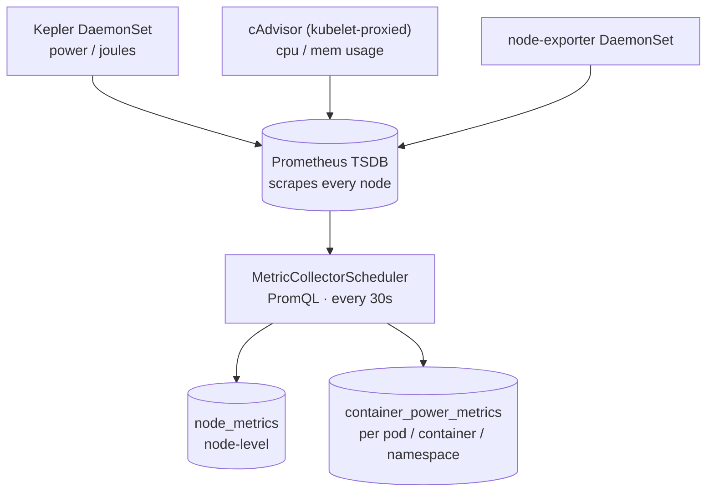
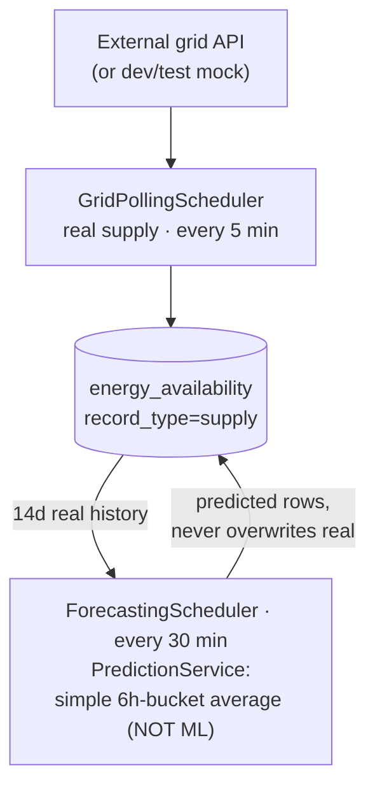
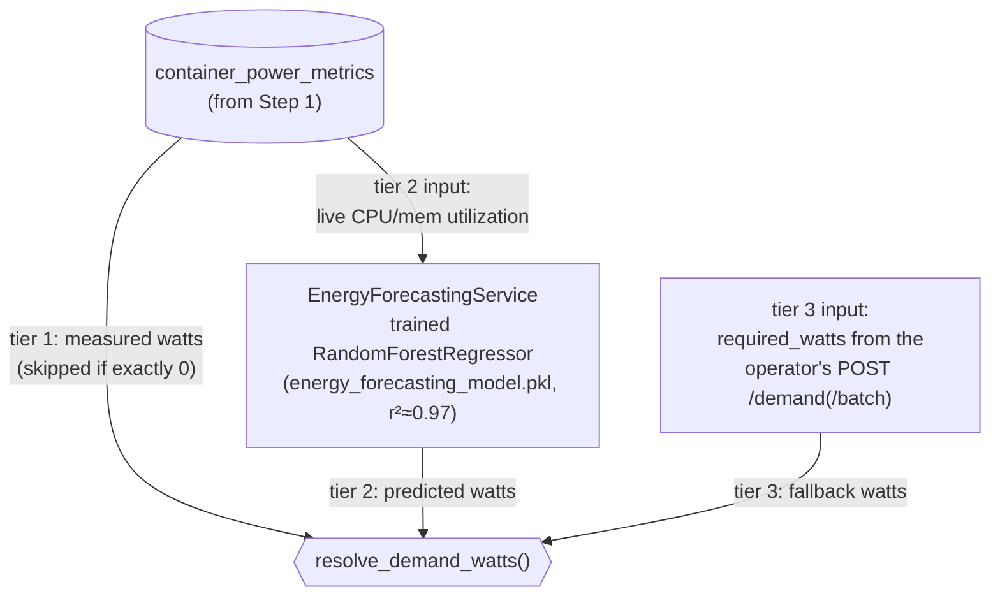
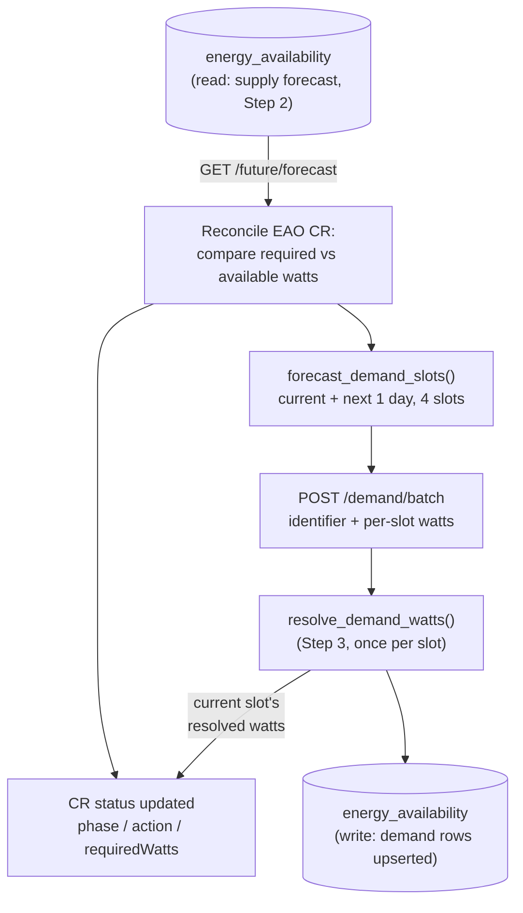
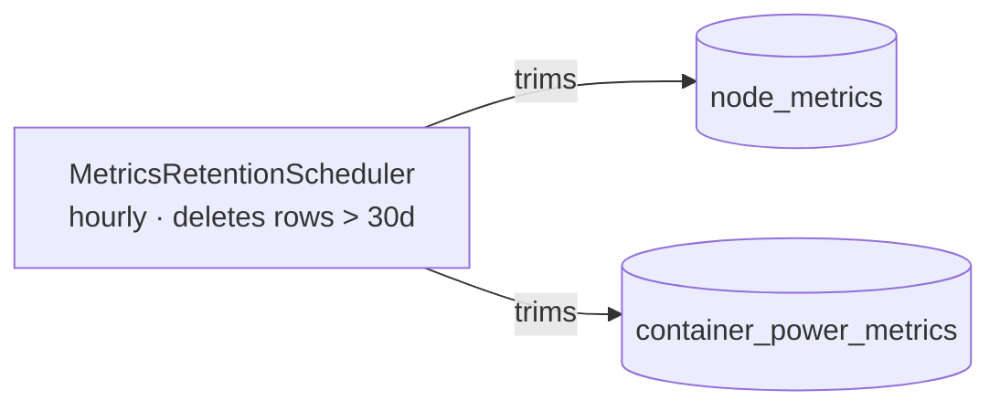

# Energy-Aware Orchestrator

A Kubernetes platform that schedules workloads based on real-time and forecasted energy availability. It collects node-level power consumption data, exposes an ML-backed forecast API, and uses a custom operator to decide when each workload should run — favouring slots with cheap or renewable energy.

See [E2E_DEMO.md](E2E_DEMO.md) for a recorded, real-command walkthrough of the full cycle across all three services, or run [e2e_demo.sh](e2e_demo.sh) for a live narrated version.

---

## Architecture

```
┌─────────────────────────────────────────────────────────────────────────┐
│                          Kubernetes Cluster                             │
│                                                                         │
│  ┌─────────────────────┐        ┌──────────────────────────────────┐     │
│  │  energy-aware-      │  calls │  energy-metric-service           │    │
│  │  operator           │───────▶│  (FastAPI + PostgreSQL)          │    │
│  │  (Kopf / Python)    │        │  /api/energy-availability/...    │    │
│  │                     │        └──────────────┬───────────────────┘    │
│  │  Watches EAO CRDs   │                       │ reads                  │
│  │  Schedules workloads│        ┌──────────────▼───────────────────┐    │
│  └─────────────────────┘        │  energy-monitoring-helm-stack    │    │
│                                 │  Kepler → Prometheus → Grafana   │    │
│  ┌─────────────────────┐        └──────────────────────────────────┘    │
│  │  orchestrator-      │                                                │
│  │  library-ui         │  ◀─────── talks to energy-metric-service       │
│  │  (Angular 20 + Nx)  │          via K8s proxy                         │
│  └─────────────────────┘                                                │
│                                                                         │
│  ┌─────────────────────┐                                                │
│  │  workload/          │  ◀─────── EAO CRs applied by the user          │
│  │  (sample manifests) │                                                │
│  └─────────────────────┘                                                │
└─────────────────────────────────────────────────────────────────────────┘
```

### Data flow

The full loop, from raw hardware counters to a scheduling decision and
back, told as five steps — each step's output is the next step's input.

**Worth stating plainly before the diagrams, since it's easy to mix up:**
two separate forecasts happen in this loop, using two different
techniques. **Supply** forecasting (Step 2) is a simple historical
average — not ML yet, a known gap. **Demand** prediction (Step 3) is an
actual trained ML model, a `RandomForestRegressor` saved as
`energy_forecasting_model.pkl`. Same-sounding job, opposite techniques —
don't swap them.

**Step 1 — Generate & Collect** (`energy-monitoring-helm-stack` →
`energy-metric-service`, every 30s)


→ `container_power_metrics` feeds Step 3's demand resolution.

**Step 2 — Forecast Supply** (feeds `energy_availability`, `record_type=supply`)


→ `energy_availability`'s supply rows feed Step 4's scheduling decision.

**Step 3 — Predict Demand** (uses `container_power_metrics` from Step 1)


→ `resolve_demand_watts()` is called once per forecast slot inside Step 4.

**Step 4 — Decide & Report** (`energy-aware-operator`, reads Step 2's
supply forecast, calls Step 3's resolver, writes back to `energy_availability`)


→ the next reconcile reads this write back in as part of Step 2/4's
current state — this is the loop closing.

**Step 5 — Clean Up** (`energy-metric-service`, hourly — a housekeeping
side-process, not part of the decision loop above)



**Components involved, generation to decision:**

- **Kepler / cAdvisor / node-exporter** — DaemonSets in `energy-monitoring-helm-stack`; the only place raw power (joules) and CPU/memory usage are actually generated. Never scraped directly by `energy-metric-service` — always through Prometheus, since a DaemonSet's own Service only ever reaches one arbitrary node's pod.
- **Prometheus** — central TSDB scraping all three sources on every node. `energy-metric-service` is a PromQL *client* of it, not a scrape target itself.
- **`MetricCollectorScheduler`** (every 30s, `ENABLE_METRICS_SCHEDULER`) — runs two independent collectors each cycle: `PrometheusMetricsService` (node-level → `node_metrics`) and `PrometheusContainerMetricsService` (per pod/container, every namespace → `container_power_metrics`).
- **`node_metrics`** — node-level power + utilization time series. Feeds the node dashboard endpoint and was the training data for `energy_forecasting_model.pkl`.
- **`container_power_metrics`** — per-`(pod, namespace, container)` power + utilization time series, collected cluster-wide (not namespace-scoped) so any EAO CR's `applicationRef` can be matched at query time. The only input to demand tiers 1-2.
- **`GridPollingScheduler`** (every 5 min) — polls the real external grid API (or the dev/test mock) for live capacity, writes it as *real* supply rows.
- **`ForecastingScheduler`** (every 30 min) — fills future slots beyond what real polling has reached, via `PredictionService` (today: a simple 6-hour-bucket historical average; the real-ML swap point is a single function and is documented but not yet implemented). Writes *predicted* supply rows, never overwriting a real one for the same slot.
- **`energy_availability`** — single table holding both supply (`record_type=supply`, `data_source=real|predicted`) and demand (`record_type=demand`, one upserted row per `(workload identifier, slot)` — a rolling forecast, not a single point). Real supply always wins over predicted for the same slot at query time.
- **`energy-aware-operator`** — separate process/deployable, same repo (`energy-aware-operator/`). On every `EnergyAwareOrchestration` CR reconcile: fetches the supply forecast, compares `required_watts` against `available_watts` to decide `Scheduled`/`DeployImmediately`/deferred, writes the CR's status, then reports the workload's resolved demand forecast back (current slot + next 1 day, via `POST /demand/batch`).
- **`resolve_demand_watts()`** — resolves what actually gets stored/reported for each demand slot, most accurate first: measured (real Kepler wattage, skipped if it sums to exactly `0`) → predicted (`EnergyForecastingService`'s trained model from live utilization) → fallback (the CR's static estimate, or explicit `0` for a slot the workload isn't running in yet). Never raises — always falls through to a safe value.
- **`MetricsRetentionScheduler`** (hourly) — the only piece that deletes anything; trims `node_metrics`/`container_power_metrics` past `METRICS_RETENTION_DAYS` (30d default) so Postgres storage doesn't grow unbounded. `energy_availability` doesn't need it since rows are upserted, not appended per cycle.

---

## Components

### 1 · `energy-aware-operator`

A Kubernetes operator written in Python using the [Kopf](https://kopf.readthedocs.io/) framework. It watches `EnergyAwareOrchestration` (EAO) custom resources and calculates when each workload should run.

**Scheduling priorities:**

| Priority | Behaviour |
|----------|-----------|
| `Critical` | Deploy immediately — no energy checks |
| `Preferred` | Deploy now if energy is sufficient; otherwise schedule for the next 6-hour slot |
| `Optional` | Find the optimal slot in the next 24 hours |

The operator re-evaluates every 10 minutes (configurable) and updates the CR status with the scheduling decision.

→ [energy-aware-operator/README.md](energy-aware-operator/README.md)

---

### 2 · `energy-metric-service`

A FastAPI service that acts as the energy data backend for the operator and the UI. `energy_availability` holds both supply (grid capacity) and demand (workload requirements) in one table, tagged `record_type`/`data_source` (`real` vs `predicted`).

- Scrapes Kepler energy metrics from Prometheus on a schedule and persists them in PostgreSQL (`container_power_metrics`).
- Polls an external grid API (or a dev/test mock server) for live supply data, and predicts supply for future slots beyond what polling has reached — real always wins over predicted at query time.
- Exposes a REST API including `/api/energy-availability/future/forecast` which the operator calls, and `/api/energy-availability/demand` (`POST`/`POST /batch`/`GET`/`DELETE`) which the operator reports a rolling multi-slot forecast to and external consumers (e.g. a grid operator) can read back.
- Resolves each workload's actual demand through a trained **Random Forest** consumption model (`app/energy_forecasting_model.pkl`, r²≈0.97, predicts watts from CPU/memory utilization) — used as a fallback tier when direct Kepler measurement isn't available, itself falling back to the operator's static estimate before deployment. (`energy_forecasting_linear_regression.pkl`/`energy_forecasting_scaler.pkl` at the repo root are earlier, unused artifacts — the model actually loaded lives under `app/`.)
- Includes a Jupyter notebook (`energy_forecasting_model.ipynb`) and training script (`train_model.py`) for retraining.

**Helm charts included:**

| Chart | Purpose |
|-------|---------|
| `charts/app` | FastAPI application |
| `charts/postgres` | Custom PostgreSQL StatefulSet |

→ [energy-metric-service/README.md](energy-metric-service/README.md) · [scheduler architecture](energy-metric-service/docs/SCHEDULER_ARCHITECTURE.md)

---

### 3 · `energy-monitoring-helm-stack`

An umbrella Helm chart that deploys the full observability stack for energy monitoring.

| Component | Version | Purpose |
|-----------|---------|---------|
| Kepler | 0.6.0 | eBPF-based node energy metrics collector |
| Prometheus | 25.21.0 | Metrics storage and PromQL queries |
| Grafana | 7.3.9 | Dashboards and visualisation |
| Node Exporter | 4.24.0 | Host-level CPU/memory metrics |

Pre-built Grafana dashboards are included in `dashboards/`:
- `pod-node-energy-dashboard.json` — pod & node energy with CPU/memory overlays
- `simple-kepler-dashboard.json` — minimal energy consumption view

→ [energy-monitoring-helm-stack/README.md](energy-monitoring-helm-stack/README.md)

---

### 4 · `orchestrator-library-ui`

An Angular 20 + Nx frontend dashboard.

**Key routes:**

| Route | Purpose |
|-------|---------|
| `/energy-metrics` | Real-time energy consumption charts (default page) |
| `/emdc/workloads/system-utilization` | Node CPU & memory utilisation |
| `/emdc/workloads/workload-deployment` | View and manage deployed workloads |
| `/emdc/workloads/register-workload` | Register a new EAO workload |

The app talks to `energy-metric-service` through an nginx proxy (`orchestrator-k8s-proxy`). In development it reads API endpoints from `.env.local`; in production it proxies via relative paths (`/api`, `/app`).

→ [orchestrator-library-ui/README.md](orchestrator-library-ui/README.md)

---

### 5 · `workload/`

Sample Kubernetes manifests for testing the operator end-to-end.

```
workload/
├── workload_cr_eao_critical.yaml   # EAO CR — Critical priority
├── workload_cr_eao_preferred.yaml  # EAO CR — Preferred priority
├── workload_cr_eao_optional.yaml   # EAO CR — Optional priority
├── workload_k8s_critical.yaml      # Backing Deployment for Critical
├── workload_k8s_preferred.yaml     # Backing Deployment for Preferred
└── workload_k8s_optional.yaml      # Backing Deployment for Optional
```

Apply with:

```bash
kubectl apply -f workload/workload_k8s_preferred.yaml
kubectl apply -f workload/workload_cr_eao_preferred.yaml
kubectl get eao
```

---

## Quick Start

See **[DEPLOY.md](DEPLOY.md)** for the full deployment guide.

```bash
# Deploy the entire stack in one command
./deploy-full-stack.sh
```

The script will:
1. Run a prerequisites check (`kubectl`, `helm`, `docker`, cluster reachability, cluster type)
2. Build + load the operator Docker image and deploy it via Helm
3. Deploy PostgreSQL and the energy-metric-service
4. Deploy the Kepler / Prometheus / Grafana monitoring stack
5. Build and deploy the Angular UI
6. Print port-forwarding commands and access URLs

**Options:**

| Flag | Purpose |
|---|---|
| `--grid-stub` / `--no-grid-stub` | Deploy the dev/test mock grid server. Defaults **on** when `--grid-url` isn't given, off when it is |
| `--grid-url URL` | Point grid polling at a real grid endpoint instead of the mock server |
| `--disable-metrics-scheduler` | Don't collect Kepler/cAdvisor metrics into `node_metrics`/`container_power_metrics`. Defaults **on** (feeds demand resolution tiers 1-2 — see [energy-metric-service/README.md](energy-metric-service/README.md#-container-metrics-collection)) |
| `--prometheus-url URL` | Override where metrics collection reads from Prometheus (default: auto-derived from `--monitoring-release`) |
| `--monitoring-release NAME` | Helm release name for the monitoring stack (default: `energy-metrics`) |
| `-n, --namespace NS` | Kubernetes namespace (default: `default`) |

```bash
./deploy-full-stack.sh deploy --grid-url http://real-grid.example.com/capacity
```

See `./deploy-full-stack.sh --help` for the full list, including `cleanup`-only flags.

---

## Repository Layout

```
energy-aware-orchestrator/
├── deploy-full-stack.sh                  # One-command full-stack deployment
├── DEPLOY.md                        # Deployment guide (prerequisites, steps, troubleshooting)
├── README.md                        # This file
├── E2E_DEMO.md                      # Cross-repo end-to-end demo: metrics → forecasting → scheduling decision (recorded run)
├── e2e_demo.sh                      # Same demo, live/interactive - narrates + executes + pauses between scenarios
│
├── energy-aware-operator/           # Kubernetes operator (Python / Kopf)
├── energy-metric-service/           # Energy API + forecasting (FastAPI / PostgreSQL)
├── energy-monitoring-helm-stack/    # Observability stack (Kepler / Prometheus / Grafana)
├── orchestrator-library-ui/         # Web dashboard (Angular 20 / Nx)
└── workload/                        # Sample EAO custom resources and workload manifests
```

---

## Service URLs (after port-forwarding)

| Service | URL | Notes |
|---------|-----|-------|
| Orchestrator UI | http://localhost:4200 | Angular dashboard |
| Energy Metric API | http://localhost:8000/docs | FastAPI Swagger |
| Grafana | http://localhost:3000 | `admin` / `admin` |
| Prometheus | http://localhost:9090 | — |
| Kepler Metrics | http://localhost:9102/metrics | Raw eBPF metrics |
| PostgreSQL | localhost:5432 | `postgres` / `postgres` / `orchestration_db` |
| K8s Proxy | http://localhost:3001 | UI backend proxy |
